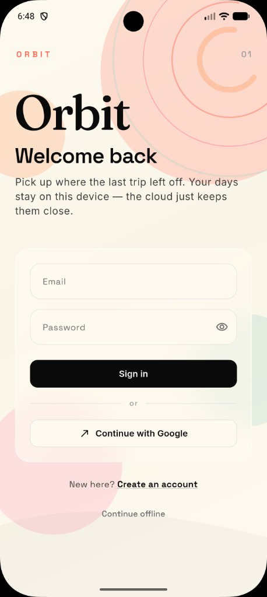
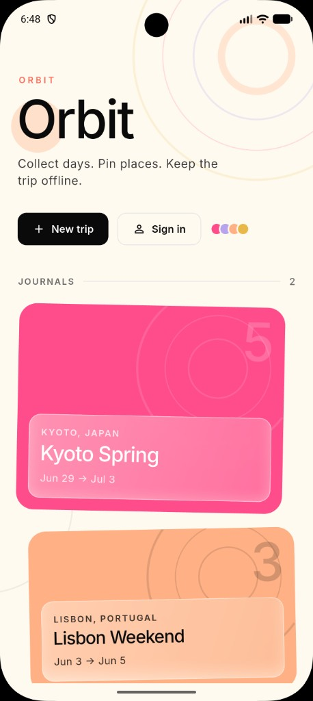
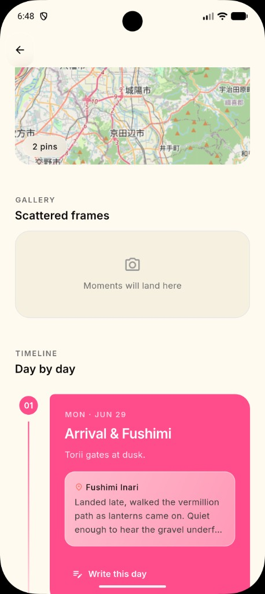

# Orbit Notes

**A quiet place for trips.**  
Journal day by day, pin the places that mattered, and keep everything on your phone until you’re ready to sync.

  
  &nbsp;
  
  &nbsp;
  

## What you can do

- **Trip → Day → Entry** — a clear journal structure for the road
- **Photos** that stay with the entry, not lost in camera roll chaos
- **Map pins** — search a place or drop a pin where you stood
- **Plan a trip** with AI, then turn it into a real journal
- **Offline first** — sign in only when you want cloud sync

## Built with

Flutter · local-first storage · maps · optional cloud sync

## Privacy

Your journals live on device by default. Location is used only when you ask for it. Sign-in is optional.

---

*Private project — Orbit Notes*
